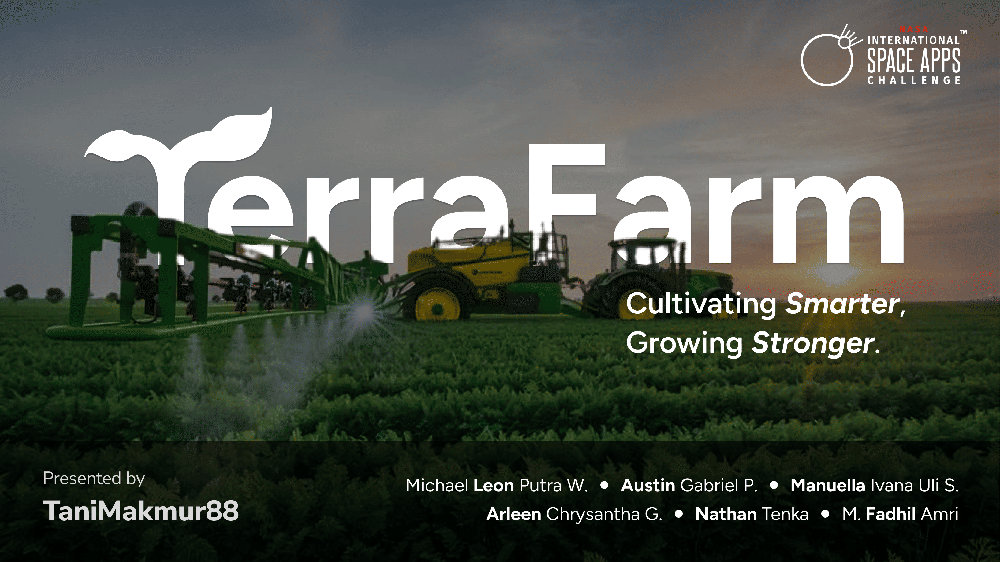

<br>
<div align="center">
    <div >
        
    </div>
    <div>
            <h3><b>TerraFarm</b></h3>
            <p><i>Cultivating Smarter, Growing Stronger.</i></p>
    </div>      
</div>
<br>
<h1 align="center">TerraFarm Machine Learning</h1>
<div align="center">



</div>
<br>
<i>AI-driven agriculture insights</i>: TerraFarm’s machine learning models analyze satellite imagery and environmental data to deliver highly accurate crop health assessments and predictive analytics. By detecting early signs of pests, diseases, or nutrient deficiencies, these models provide farmers with timely, actionable advice that can prevent crop loss and boost productivity.

## 👨🏻‍💻 &nbsp;Technology Stack

<div align="center">
<a href="https://react.dev/">
<kbd>

</kbd>
</a>

<a href="https://www.typescriptlang.org/">
<kbd>

</kbd>
</a>

<a href="https://tailwindcss.com/">
<kbd>

</kbd>
</a>

</div>
<div align="center">
<h4>FastAPI | Keras | Docker</h4>
</div>
<br>

## ⚙️ &nbsp;How to Run
1. **Clone the repository** from the terminal using the following command:
    ```bash
    $ git clone https://github.com/TerraFarm-TaniMakmur88/TerraFarm_ML.git
    ```

2. **Run the server** using this following command, make sure you have Docker Desktop on your device.
    ```bash
    $ docker compose up
    ```

3. TerraFarm ML server should be running. You can also check the server by opening [http://localhost:8080](http://localhost:8080) in your web browser.


## 💡 Dataset Overview
The dataset powering the TerraFarm Machine Learning Server is sourced from NASA's POWER API. It includes key parameters that are critical to predicting farm land conditions, based on extensive research. The selected parameters are:

- T2M (Temperature)
- WS2M (Windspeed)
- RH2M (Relative Humidity)
- PRECTOTCORR (Precipitation)

To enhance the model's accuracy, we also incorporate LAT (latitude) and LONG (longitude) as spatial data, which helps determine weather patterns specific to each location.

### Geographical Focus: Indonesia

Indonesia spans latitudes from -11.1625 to 6.1088, and longitudes from 94.41 to 141.08. To serve farmers across the country, we employed a grid search approach with a 0.5° precision for latitude and longitude. This provides comprehensive coverage of Indonesian farmlands without overwhelming the dataset.
Data Volume and Granularity

- The dataset contains 28.89 million data points, making it robust and comprehensive.
- The data is recorded hourly, which is essential since weather conditions can change significantly within short time intervals.
- Missing values are represented as -999, and these should be properly handled before proceeding with further machine learning (ML) tasks.

## 📌 Machine Learning Task Overview

The project involves multivariate time series analysis, where the target variables depend not only on time but also on other parameters like spatial data. This makes the task a spatio-temporal forecasting challenge.

To address this, several modeling techniques have been considered:

- Traditional Machine Learning: Regressors
- Deep Learning: Models such as LSTM (Long Short-Term Memory) and CNN (Convolutional Neural Networks)
- Advanced ML Techniques: Hierarchical Time Series and Spatio-Temporal Graph Neural Networks (GNNs)

### Approach Used

In this project, we employ two key machine learning models:

- **XGBoost (Extreme Gradient Boosting)**:
    XGBoost excels with multivariate data, particularly when multiple weather parameters are provided. It is highly accurate for predicting other weather conditions when time, location, and additional parameters are known.

- **LSTM (Long Short-Term Memory)**:
    LSTM is a deep learning model that performs well in time series tasks because it processes sequential data and has memory capabilities. In this project, LSTM is specifically used for spatio-temporal forecasting of individual weather parameters based on location and time.

By combining the strengths of XGBoost and LSTM, we aim to create an accurate and efficient system for weather prediction that benefits farmers with reliable, hour-by-hour forecasts.

## 👥 &nbsp;Contributors
| <div align="center"><a href="https://github.com/mikeleo03"></a></div> | <div align="center"><a href="https://github.com/arleenchr"></a></div> | <div align="center"><a href="https://github.com/AustinPardosi"></a></div> |
| ---------------------------------------------------------------------------------------------------------------------------------------------------------------------------------------------------------------------------------- | ----------------------------------------------------------------------------------------------------------------------------------------------------------------------------------------------------------------------------------- | ----------------------------------------------------------------------------------------------------------------------------------------------------------------------------------------------------------------------------- |
| <div align="center"><h3><b><a href="https://github.com/mikeleo03">Michael Leon Putra Widhi</a></b></h3><i><p>Bandung Institute of Technology</i></p></div>                                                                                        | <div align="center"><h3><b><a href="https://github.com/arleenchr">Arleen Chrysantha Gunardi</a></b></h3></a><p><i>Bandung Institute of Technology</i></p></div>                                                               | <div align="center"><h3><b><a href="https://github.com/AustinPardosi">Austin Gabriel Pardosi</a></b></h3></a><p><i>Bandung Institute of Technology</i></p></div>                                                                            
| <div align="center"><a href="https://github.com/Nat10k"></a></div> | <div align="center"><a href="https://github.com/manuellaiv"></a></div> | <div align="center"><a href="https://github.com/Mehmed13"></a></div> |
| <div align="center"><h3><b><a href="https://github.com/Nat10k">Nathan Tenka</a></b></h3><i><p>Bandung Institute of Technology</i></p></div>                                                                                        | <div align="center"><h3><b><a href="https://github.com/manuellaiv">Manuella Ivana Uli Sianipar</a></b></h3></a><p><i>Bandung Institute of Technology</i></p></div>                                                               | <div align="center"><h3><b><a href="https://github.com/Mehmed13">Muhammad Fadhil Amri</a></b></h3></a><p><i>Bandung Institute of Technology</i></p></div>                                                                            |